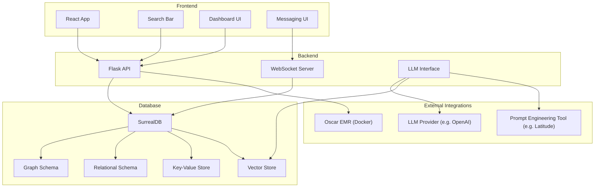
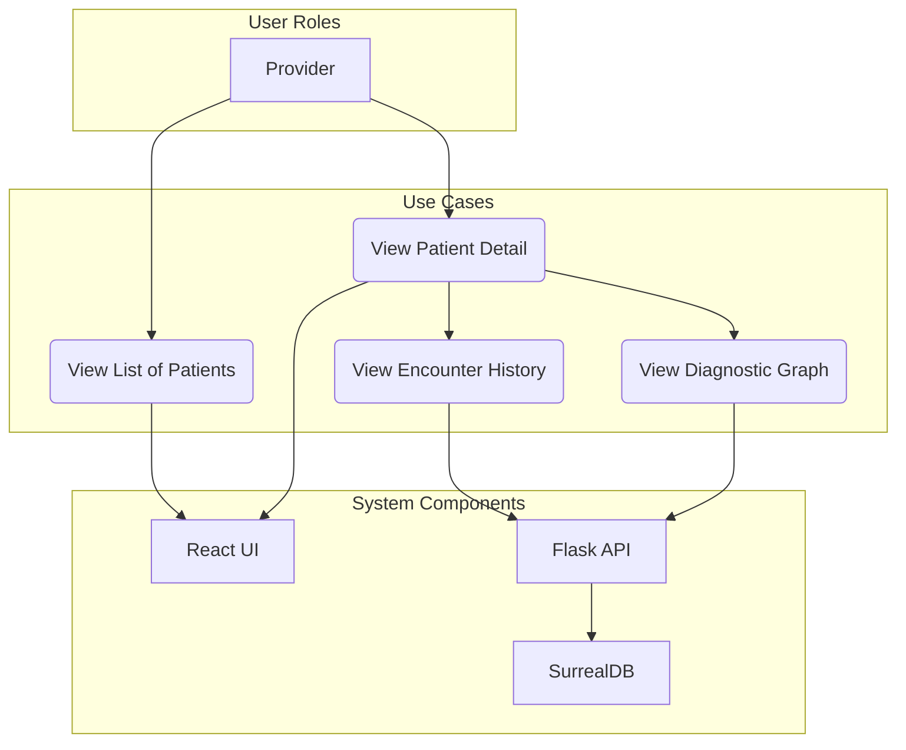
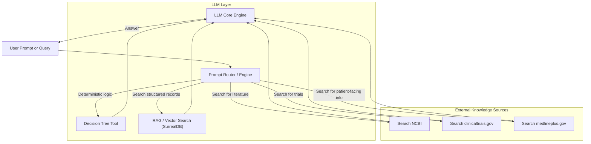
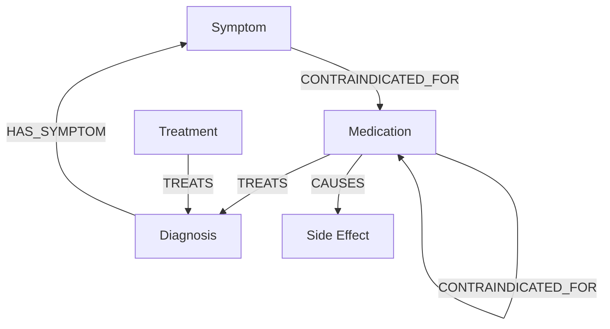

# ArsMedicaTech

**ArsMedicaTech** is an integrated clinical platform designed to support a wide range of use cases across modern healthcare workflows. Combining a flexible backend architecture with cutting-edge AI tools and EMR interoperability, the project aims to deliver a unified, extensible interface for providers, patients, and researchers.

---

## 🚀 Purpose & Vision

ArsMedicaTech is built to support the evolving digital needs of healthcare. Its long-term vision is to:

* Bridge human decision-making and AI recommendations using LLMs with deterministic guardrails.
* Unify disparate data sources including patient records, medical ontologies, and clinical knowledge into a cohesive graph model.
* Enable modular, multimodal interaction via a modern UI for providers and patients alike.
* Serve as a developer-friendly testbed for experimentation and contribution in clinical informatics.

---

## 🧱 Tech Stack

| Layer             | Technology                                                                               |
| ----------------- | ---------------------------------------------------------------------------------------- |
| Frontend          | React (soon to be converted to TypeScript)                                               |
| Backend           | Flask (Python)                                                                           |
| Database          | SurrealDB (multi-model support: graph, relational, document, key-value, full-text, etc.) |
| Infrastructure    | Dockerized stack with Nginx, Oscar EMR, and SurrealDB containers                         |
| AI/ML Integration | OpenAI-compatible LLMs (planned: RAG, fine-tuning, prompt engineering)                   |
| EMR Integration   | Dockerized **OSCAR EMR** instance (BC configuration currently supported)                 |

---

## ✅ Completed Features

### 🧠 Data Architecture

* [x] **Graph schema** for symptoms ↔ diagnoses ↔ treatments ↔ medications.
* [x] **Key-Value store** for ICD diagnostic codes.
* [x] **Relational schema** for patient records and histories.
* [x] **Document schema** for clinical forms.
* [x] **Geospatial schema** for mapping referral clinics.
* [x] **Full-text search** on encounter histories.

### 🖥️ Frontend

* [x] Modular **dashboard layout** (topbar, sidebar, central view).
* [x] Basic **calendar**, **visual chart**, and **onboarding flow**.
* [x] Prototype **messaging screen** (UI only, live data coming soon).
* [x] **Search bar** integrated globally across screens.

### 🔧 DevOps & Deployment

* [x] Dockerized Flask API
* [x] Dockerized React App
* [x] Dockerized Nginx reverse proxy
* [x] Dockerized Oscar EMR (MariaDB, Tomcat, Catalina config included)
* [x] Dockerized SurrealDB instance

---

## 📅 Roadmap

### 🔄 Near-Term Priorities

* [ ] Replace all **hardcoded test data** with SurrealDB-backed endpoints [AMT-016](https://github.com/darren277/arsmedicatech/issues/39).
* [ ] **Pull data from Oscar EMR** into SurrealDB [AMT-014](https://github.com/darren277/arsmedicatech/issues/36).
* [ ] Launch **live messaging** using WebSockets [AMT-017](https://github.com/darren277/arsmedicatech/issues/42).
* [ ] Add **profile screen and editing** [AMT-022](https://github.com/darren277/arsmedicatech/issues/43).
* [ ] Implement **settings panel** (e.g., dark mode toggle) [AMT-020](https://github.com/darren277/arsmedicatech/issues/45).
* [ ] Build **notifications system** [AMT-019](https://github.com/darren277/arsmedicatech/issues/44).

### 🧠 AI Integration

* [ ] Add **prompt engineering** support (e.g., Latitude.so) [AMT-025](https://github.com/darren277/arsmedicatech/issues/65).
* [ ] Implement **Retrieval-Augmented Generation (RAG)** with SurrealDB vector store [AMT-024](https://github.com/darren277/arsmedicatech/issues/64).
* [ ] Add support for **LLM fine-tuning** [AMT-023](https://github.com/darren277/arsmedicatech/issues/63).
* [ ] Build **decision tree integration** for deterministic AI reasoning [AMT-026](https://github.com/darren277/arsmedicatech/issues/66).

### 🧰 Developer Experience

* [ ] Convert frontend codebase to **TypeScript** with linting/formatting [AMT-027](https://github.com/darren277/arsmedicatech/issues/67).
* [ ] Split `EncounterTable` and `PatientTable` for better UX [AMT-028](https://github.com/darren277/arsmedicatech/issues/70).

---

## 🌐 Contributing

This project is still in active development, and contributions are welcome. Whether you're a clinician, developer, designer, or informatician, there's room for you in the ArsMedicaTech community.

---

## 📄 License

***TBD** — Will be updated upon reaching MVP milestone.*

---

## Architecture

### System Architecture Overview



### Viewing a Patient's Medical History



### LLM Tool-Calling Integration

**Prompt Router / Engine**: This is a preprocessing step or plugin system that selects which tools the LLM should call, based on structured patterns or keywords.

**Decision Tree Tool**: Ensures deterministic logic for certain clinical reasoning paths — important for trust and auditability.

**External APIs**:
* **NCBI**: Literature searches (PubMed, etc.).
* **clinicaltrials.gov**: Active and historical clinical trials.
* **medlineplus.gov**: Government-reviewed patient-facing medical info.

**SurrealDB as Vector Store**: RAG queries for internal or private documents with embeddings.




## How to Use

TBD...

### Webpack devServer vs Webpack build vs No Webpack...?

`webpack serve --config ./webpack.config.js --mode development --port 3010`

vs...

`npm start ./src/index.js`

`npm start ./src/index.js --port=3010 --proxy=http://127.0.0.1:5010`

## Databases

### SurrealDB

#### Connecting Remotely

1. Expose a port forward route: `kubectl port-forward service/surrealdb 8000:8000 -n arsmedicatech`.
2. Then, you can connect however you choose, for example by using the Surrealist UI desktop application.

#### ICD

Example: `section111validicd10-jan2025_0.csv`:
```csv
CODE,SHORT DESCRIPTION (VALID ICD-10 FY2025),LONG DESCRIPTION (VALID ICD-10 FY2025)
A000,"Cholera due to Vibrio cholerae 01, biovar cholerae","Cholera due to Vibrio cholerae 01, biovar cholerae"
A001,"Cholera due to Vibrio cholerae 01, biovar eltor","Cholera due to Vibrio cholerae 01, biovar eltor"
A009,"Cholera, unspecified","Cholera, unspecified"
A0100,"Typhoid fever, unspecified","Typhoid fever, unspecified"
A0101,Typhoid meningitis,Typhoid meningitis
```

#### Graph

We have added a graph database to our ecosystem.

For now, it just has some basic example nodes and relationships such as:
* `Diagnosis` -> `HAS_SYMPTOM` -> `Symptom`.
* `Medication` -> `TREATS` -> `Diagnosis`.
* `Symptom` -> `CONTRAINDICATED_FOR` -> `Medication`.
* `Medication` => `CONTRAINDICATED_FOR` => `Medication`.

Admittedly, it took me some time to start wrapping my head around the querying syntax for relationships, so I did not explore them as far as I would have liked to this time around.

I definitely plan on tackling some more complex use cases in the future as there is a lot of potential for that with graph databases.

Another caveat is that, currently as of this writing, a lot of the queries are a mix of standalone functions and use of our dedicated wrapper controller I started building out. I'd of course like that to be more consistent, but will return to that in the future.

##### Clinical Knowledge Graph (Graph Schema)



##### Some Possible Future Direction to Explore

Add More Fields: You can store additional fields (e.g., `icd_code`, `description`, `severity`) on both node records and edge records.

Schema Definitions (Optional): SurrealDB allows schema definitions (`SCHEMAFULL`, `SCHEMALESS`) to enforce constraints if you want more structure.

Additional Node Types: Over time, you might add `Treatment` or `Procedure` nodes, or even `SideEffect` nodes.

Complex Edges: You could represent more nuanced relationships (e.g., “alleviates symptom,” “risk factor for,” “co-morbidity with,” etc.).

Integration with External Data: To fill out a large knowledge graph, you can look into open data sources:
* ICD-10/11 codes (WHO)
* UMLS Metathesaurus (NIH)
* SNOMED CT

## MCP (Model Context Protocol)

### Usage

#### Inspector

1. Start a temporary port forward: `kubectl port-forward -n arsmedicatech service/mcp-server 9000:80`.
2. Run the inspector client: `npx @modelcontextprotocol/inspector@0.14.0`.
3. Navigate to the URL. Something like this: http://127.0.0.1:6274/#tools
4. Enter the URL: http://127.0.0.1:9000/mcp.
5. Click "Connect" to view the available tools.
