# ArsMedicaTech

**ArsMedicaTech** is an integrated clinical platform designed to support a wide range of use cases across modern healthcare workflows. Combining a flexible backend architecture with cutting-edge AI tools and EMR interoperability, the project aims to deliver a unified, extensible interface for providers, patients, and researchers.

**A note about interest in this project**: Right now it is still in early stages, and I contribute to it when I can, but if anyone stumbles upon this and finds that it has the potential to do a lot of good, I am willing to upscale my efforts.

If anyone has any new ideas, suggestions, questions, would like to contribute, or would like to express even a general interest in the project, I can be reached via the e-mail address in my profile <https://github.com/darren277>.

I also opened up the Discussions section for this repository for anyone who would like to suggest anything or express any interest at all.

Also, check out <https://github.com/users/darren277/projects/1> to see what's currently being worked on and what's on the backlog.

---

## 🚀 Purpose & Vision

ArsMedicaTech is built to support the evolving digital needs of healthcare. Its long-term vision is to:

* Bridge human decision-making and AI recommendations using LLMs with deterministic guardrails.
* Unify disparate data sources including patient records, medical ontologies, and clinical knowledge into a cohesive graph model.
* Enable modular, multimodal interaction via a modern UI for providers and patients alike.
* Serve as a developer-friendly testbed for experimentation and contribution in clinical informatics.

---

## 🧱 Tech Stack

| Layer             | Technology                                                                               |
| ----------------- | ---------------------------------------------------------------------------------------- |
| Frontend          | React (soon to be converted to TypeScript)                                               |
| Backend           | Flask (Python)                                                                           |
| Database          | SurrealDB (multi-model support: graph, relational, document, key-value, full-text, etc.) |
| Infrastructure    | Dockerized stack with Nginx, Oscar EMR, and SurrealDB containers                         |
| AI/ML Integration | OpenAI-compatible LLMs (planned: RAG, fine-tuning, prompt engineering)                   |
| EMR Integration   | Dockerized **OSCAR EMR** instance (BC configuration currently supported)                 |

---

## ✅ Completed Features

### 🧠 Data Architecture

* [x] **Graph schema** for symptoms ↔ diagnoses ↔ treatments ↔ medications.
* [x] **Key-Value store** for ICD diagnostic codes.
* [x] **Relational schema** for patient records and histories.
* [x] **Document schema** for clinical forms.
* [x] **Geospatial schema** for mapping referral clinics.
* [x] **Full-text search** on encounter histories.

### 🖥️ Frontend

* [x] Modular **dashboard layout** (topbar, sidebar, central view).
* [x] Basic **calendar**, **visual chart**, and **onboarding flow**.
* [x] Prototype **messaging screen** (UI only, live data coming soon).
* [x] **Search bar** integrated globally across screens.

### 🔧 DevOps & Deployment

* [x] Dockerized Flask API
* [x] Dockerized React App
* [x] Dockerized Nginx reverse proxy
* [x] Dockerized Oscar EMR (MariaDB, Tomcat, Catalina config included)
* [x] Dockerized SurrealDB instance

---

## 📅 Roadmap

### 🔄 Near-Term Priorities

* [ ] Replace all **hardcoded test data** with SurrealDB-backed endpoints [AMT-016](https://github.com/darren277/arsmedicatech/issues/39).
* [ ] **Pull data from Oscar EMR** into SurrealDB [AMT-014](https://github.com/darren277/arsmedicatech/issues/36).
* [ ] Launch **live messaging** using WebSockets [AMT-017](https://github.com/darren277/arsmedicatech/issues/42).
* [ ] Add **profile screen and editing** [AMT-022](https://github.com/darren277/arsmedicatech/issues/43).
* [ ] Implement **settings panel** (e.g., dark mode toggle) [AMT-020](https://github.com/darren277/arsmedicatech/issues/45).
* [ ] Build **notifications system** [AMT-019](https://github.com/darren277/arsmedicatech/issues/44).

### 🧠 AI Integration

* [ ] Add **prompt engineering** support (e.g., Latitude.so) [AMT-025](https://github.com/darren277/arsmedicatech/issues/65).
* [ ] Implement **Retrieval-Augmented Generation (RAG)** with SurrealDB vector store [AMT-024](https://github.com/darren277/arsmedicatech/issues/64).
* [ ] Add support for **LLM fine-tuning** [AMT-023](https://github.com/darren277/arsmedicatech/issues/63).
* [ ] Build **decision tree integration** for deterministic AI reasoning [AMT-026](https://github.com/darren277/arsmedicatech/issues/66).

### 🧰 Developer Experience

* [ ] Convert frontend codebase to **TypeScript** with linting/formatting [AMT-027](https://github.com/darren277/arsmedicatech/issues/67).
* [ ] Split `EncounterTable` and `PatientTable` for better UX [AMT-028](https://github.com/darren277/arsmedicatech/issues/70).

---

## 🌐 Contributing

This project is still in active development, and contributions are welcome. Whether you're a clinician, developer, designer, or informatician, there's room for you in the ArsMedicaTech community.

See also: [`CONTRIBUTING.md`](./docs/source/CONTRIBUTING.md) for guidelines on how to contribute.

Or, alternatively, another way to contribute is to [sponsor the project](./docs/source/DONATE.md) to help fund development and maintenance.

But, most importantly of all at this early stage, simply expressing any interest, either openly in [our discussions section](https://github.com/darren277/arsmedicatech/discussions), or privately via email ([see profile](https://github.com/darren277)), would be a major start.

---

## 🛡️ License & Reciprocity

ArsMedicaTech is released under the **GNU Affero General Public License v3 (AGPL-3.0-or-later)**.  
⚖️  Any party that deploys a modified version as a network service **must publicly release its source code under the same license**.  
This server-side copyleft keeps improvements transparent while ensuring patients retain freedom and auditability.

> *Short version*: Use it, improve it, even run it commercially - but if you host or sell a modified edition you **must** give the community those changes.

---

## ❓ Commercial-Use FAQ (abridged)

| Question | Answer                                                                                                                               |
|----------|--------------------------------------------------------------------------------------------------------------------------------------|
| **Can we run our own hosted instance for our clinic?** | Yes. Just leave the copyright headers intact and publish any code changes per AGPL §13.                                              |
| **Can we charge patients or hospitals?** | We won’t police fair cost-recovery.  We do ask you keep fees **reasonable and non-exploitative**, and upstream your improvements.    |
| **Can we rebrand and close-source extra features?** | No.  Any derivative network service must remain AGPL.  Proprietary forks violate the license.                                        |
| **How can we give back?** | • Submit pull requests  • Fund upstream development (see [`DONATE.md`](./docs/source/DONATE.md))  • Offer pro-bono clinical feedback |

---

## ❤️ Supporting the Project

This project is sustained by community donations rather than venture capital.  
If ArsMedicaTech helps your patients or practice, please consider a small monthly sponsorship.  Details in [`DONATE.md`](./DONATE.md).

---

## Architecture

### System Architecture Overview


### Viewing a Patient's Medical History


### LLM Tool-Calling Integration

**Prompt Router / Engine**: This is a preprocessing step or plugin system that selects which tools the LLM should call, based on structured patterns or keywords.

**Decision Tree Tool**: Ensures deterministic logic for certain clinical reasoning paths — important for trust and auditability.

**External APIs**:
* **NCBI**: Literature searches (PubMed, etc.).
* **clinicaltrials.gov**: Active and historical clinical trials.
* **medlineplus.gov**: Government-reviewed patient-facing medical info.

**SurrealDB as Vector Store**: RAG queries for internal or private documents with embeddings.


## Messaging

### Notifications

Live updates and notifications are handled using SSE (Server-Sent Events) via Redis for a PubSub queue.

| Event Type              | Payload Example                                                                 |
| ----------------------- | ------------------------------------------------------------------------------- |
| `new_message`           | `{ type: 'new_message', conversationId: '123', sender: 'provider', content: 'Hello!' }` |
| `system_notification`   | `{ type: 'system_notification', content: 'Your profile is incomplete' }`       |
| `appointment_reminder` | `{ type: 'appointment_reminder', appointmentId: '456', time: '2025-02-20T10:00:00Z' }` |

### Usage

To notify users when a new message is saved, you can implement a function that publishes an event to the Redis PubSub queue. This function should be called after successfully saving the message in the database.

```python
def notify_on_message_save(msg, recipient):
    # After storing the message successfully
    if success and msg_obj:
        event = {
            "type": "new_message",
            "conversation_id": conversation_id,
            "sender": "Dr. Smith",  # Or look up sender
            "text": message_text,
            "timestamp": str(msg_obj.created_at)
        }
        # Notify recipient
        for participant_id in conversation.participant_ids:
            if participant_id != current_user_id:
                publish_event(participant_id, event)
```

```python
def send_appointment_reminder():
    publish_event(user_id=42, event_data={
        "type": "appointment_reminder",
        "time": "2025-07-11T10:00:00Z",
        "content": "Annual checkup"
    })
```

### Running Redis Locally

To run Redis locally, you can use Docker:

```bash
docker run --name redis -d -p 6379:6379 redis:latest
```

Then, you can connect to it using a Redis client library in your application.

### Testing

`{USER_ID}` is the user ID of the recipient, which can be obtained from your user management system or database.

It looks something like `User:8jz38zk55xaboplbo9at`.

```shell
# Send a test message
python test/send_notification.py {USER_ID} new_message "Hello from CLI!"

# Send an appointment reminder
python test/send_notification.py {USER_ID} appointment_reminder "Your appointment is tomorrow"

# Send a system notification
python test/send_notification.py {USER_ID} system_notification "System maintenance scheduled"
```

## How to Use

TBD...

### Webpack devServer vs Webpack build vs No Webpack...?

`webpack serve --config ./webpack.config.js --mode development --port 3010`

vs...

`npm start ./src/index.js`

`npm start ./src/index.js --port=3010 --proxy=http://127.0.0.1:5010`

## Databases

### SurrealDB

#### Connecting Remotely

1. Expose a port forward route: `kubectl port-forward service/surrealdb 8000:8000 -n arsmedicatech`.
2. Then, you can connect however you choose, for example by using the Surrealist UI desktop application.

#### ICD

Example: `section111validicd10-jan2025_0.csv`:
```csv
CODE,SHORT DESCRIPTION (VALID ICD-10 FY2025),LONG DESCRIPTION (VALID ICD-10 FY2025)
A000,"Cholera due to Vibrio cholerae 01, biovar cholerae","Cholera due to Vibrio cholerae 01, biovar cholerae"
A001,"Cholera due to Vibrio cholerae 01, biovar eltor","Cholera due to Vibrio cholerae 01, biovar eltor"
A009,"Cholera, unspecified","Cholera, unspecified"
A0100,"Typhoid fever, unspecified","Typhoid fever, unspecified"
A0101,Typhoid meningitis,Typhoid meningitis
```

#### Graph

We have added a graph database to our ecosystem.

For now, it just has some basic example nodes and relationships such as:
* `Diagnosis` -> `HAS_SYMPTOM` -> `Symptom`.
* `Medication` -> `TREATS` -> `Diagnosis`.
* `Symptom` -> `CONTRAINDICATED_FOR` -> `Medication`.
* `Medication` => `CONTRAINDICATED_FOR` => `Medication`.

Admittedly, it took me some time to start wrapping my head around the querying syntax for relationships, so I did not explore them as far as I would have liked to this time around.

I definitely plan on tackling some more complex use cases in the future as there is a lot of potential for that with graph databases.

Another caveat is that, currently as of this writing, a lot of the queries are a mix of standalone functions and use of our dedicated wrapper controller I started building out. I'd of course like that to be more consistent, but will return to that in the future.

##### Clinical Knowledge Graph (Graph Schema)


##### Some Possible Future Direction to Explore

Add More Fields: You can store additional fields (e.g., `icd_code`, `description`, `severity`) on both node records and edge records.

Schema Definitions (Optional): SurrealDB allows schema definitions (`SCHEMAFULL`, `SCHEMALESS`) to enforce constraints if you want more structure.

Additional Node Types: Over time, you might add `Treatment` or `Procedure` nodes, or even `SideEffect` nodes.

Complex Edges: You could represent more nuanced relationships (e.g., “alleviates symptom,” “risk factor for,” “co-morbidity with,” etc.).

Integration with External Data: To fill out a large knowledge graph, you can look into open data sources:
* ICD-10/11 codes (WHO)
* UMLS Metathesaurus (NIH)
* SNOMED CT

## MCP (Model Context Protocol)

### Usage

#### Inspector

1. Start a temporary port forward: `kubectl port-forward -n arsmedicatech service/mcp-server 9000:80`.
2. Run the inspector client: `npx @modelcontextprotocol/inspector@0.14.0`.
3. Navigate to the URL. Something like this: http://127.0.0.1:6274/#tools
4. Enter the URL: http://127.0.0.1:9000/mcp.
5. Click "Connect" to view the available tools.

## API Integrations

### Optimal

[Optimal](https://optimal.apphosting.services) is an API for mathematical optimization-as-a-service. It is actually another project of mine.

The use case implemented here is for individuals (patients or healthcare providers) to mathematically calculate an optimal diet for a particular condition. The first example provided is for managing hypertension.

## Documentation

To generate docs: `sphinx-apidoc -o docs/source/api lib`.
To build the docs: `sphinx-build -b html docs/source docs/_build/html`.

To test before build: `sphinx-build -v -b html docs docs/_build/html`.

### TODO

WARNING: autodoc: failed to import module 'mcp_server' from module 'llm.mcp'; the following exception was raised:
No module named 'trees' [autodoc.import_object]
WARNING: autodoc: failed to import module 'trees' from module 'llm.mcp'; the following exception was raised:
No module named 'mcp_init' [autodoc.import_object]

## MyPy

mypy --explicit-package-bases lib settings.py

### Some Notes on Edge Cases

I tried to limit my use of `# type: ignore` as much as possible, but I encountered a few edge cases that were more trouble than the static typing was worth (for the time being, at least).

Some of those cases:
* SurrealDB controller methods with ambiguous signatures.
* Flask `session` object.
* The `Faker` library.
* And a few other very isolated cases.

If time permits, I will return to these, but there is so much more value to be gained elsewhere.

As for `disable_error_code = no-any-return`, this one I will likely be returning to sooner than later.

## Celery Worker

1. Make sure Redis is running for Celery.
2. Start the Celery worker: `celery -A celery_worker.celery_app worker --pool=solo --loglevel=info`.
3. Ensure Flask app is running and can access Redis and S3.

## Extensions

You can add extensions to the project by creating a new directory under `plugins/` and implementing the required functionality.

There is an example plugin called `hello_world` that demonstrates how to create a simple Flask route.

As for frontend plugins, the feature is very experimental, but there is a mechanism in place.

Install Babel standalone: `npm install @babel/standalone`

You will need to transpile any JSX to JS first: `node plugins/jsx2js.js plugins/hello_world/js/index.jsx plugins/hello_world/js/index.js`

## LiveKit

| Config field (YAML)                | Default                                | Purpose in practice                                                                                    | Expose to Internet?        |
| ---------------------------------- | -------------------------------------- | ------------------------------------------------------------------------------------------------------ | -------------------------- |
| **`port`** (top level)             | `7880`                                 | REST/HTTP **and** “/rtc” WebSocket *if* you also set `rtc.port` to the same value.                     | **Yes** (TCP)              |
| **`rtc.port`**                     | *unset* ⇒ falls back to `rtc.tcp_port` | **WebSocket signalling endpoint**. Must equal the host/port your frontend connects to (`wss://…/rtc`). | **Yes** (TCP)              |
| **`rtc.tcp_port`**                 | `7881`                                 | ICE **media‑fallback over TCP** (if UDP blocked on client). Not used for HTTP.                         | Yes (TCP)                  |
| **`rtc.udp_port`**                 | `3478`                                 | ICE host candidate over UDP (sometimes called “UDP‑ICE” or “STUN reflexive”).                          | Yes (UDP)                  |
| **`turn.udp_port`**                | `3478` (often same as above)           | TURN allocation (UDP).                                                                                 | Yes (UDP)                  |
| **`turn.tls_port`**                | `5349` (if enabled)                    | TURN allocation over TLS/TCP (optional).                                                               | Yes (TCP)                  |
| **`turn.relay_range_start / end`** | `30000–40000` dev/prod defaults        | **UDP relay ports** where media actually flows when TURN is in use.                                    | Yes (UDP, the whole range) |

```mermaid
flowchart LR
    subgraph Browser / Client
        A[JavaScript SDK<br/>wss://host/rtc] -->|HTTP Upgrade| B(WebSocket)
        B -->|ICE Gathering| C(ICE<br/>candidates)
    end

    subgraph Ingress / LB
        D1[/"443 or 80 → 7880<br/>(TLS termination)"/]
        D2[/"3478 (UDP)"/]
        D3[/"7881 (TCP)"/]
        D4[/"50000‑50010&nbsp;(UDP relay)"/]
    end

    subgraph LiveKit Pod
        LK1[[`port` 7880<br/>REST + /rtc WS]]
        LK2[[`rtc.tcp_port` 7881<br/>TCP ICE]]
        LK3[[`rtc.udp_port` 3478<br/>STUN / UDP ICE]]
        LK4[["TURN server<br/>3478 (udp/tls)<br/>relay 50000‑50010"]]
    end

    %% connections
    A --> D1
    D1 --> LK1

    B -.-> D3
    D3 -.-> LK2

    C -. UDP ICE .-> D2 -.-> LK3
    C -. TURN relay .-> D4 -.-> LK4
```



